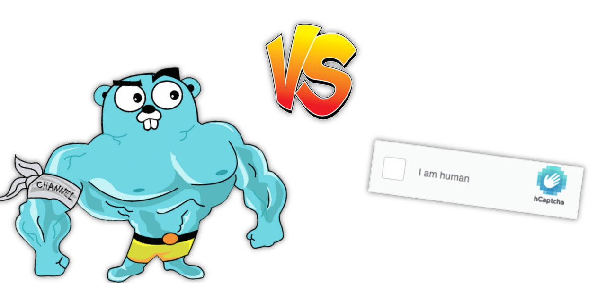

# go-hcaptcha

A Go library for solving hCaptchas with any image recognition API.



## Basic Usage
In order to solve, you need the site URL (not the domain!), and the site key, which can be found 
in the HTML of the website with the hCaptcha challenge.

Below is a basic example of how to use the solver with the two using a simple guessing solver.
```go
c, err := NewChallenge(siteUrl, siteKey)
if err != nil {
    panic(err)
}
err = c.Solve(&GuessSolver{})
if err != nil {
    panic(err)
}
fmt.Println(c.Token()) // P0_eyJ0eXAiOiJKV1QiLC...
```

## Custom Solvers
Custom solvers can be implemented with ease. All solvers need to implement the `Solver` interface. You
can link this with any image recognition API you want.

You can see an example of this with the `GuessSolver` implementation in `solver.go`.

## Credits

### 2.0.1
A few changes to support the modern API, and general code cleanup along with a switch to `mathgl` for
Bézier curve creation.

### 2.0.0
The motion data capturing required with hCaptcha would not be possible without the work of 
[@h0nde](https://github.com/h0nde) and his [py-hcaptcha](https://github.com/h0nde/py-hcaptcha) solver in Python.

### 1.0.2:
There were quite a lot of changes with the hCaptcha API, so the solver was updated to reflect these changes, with
the generous help of [@aw1875](https://github.com/aw1875) and his [puppeteer-hcaptcha](https://github.com/aw1875/puppeteer-hcaptcha) 
solver in JavaScript.

### 1.0.0
This project was inspired by the work of [@JimmyLaurent](https://github.com/JimmyLaurent) and his [hcaptcha-solver](https://github.com/JimmyLaurent/hcaptcha-solver)
also in JavaScript. I'd like to thank him for his work, and for being a motivation to create this library.
