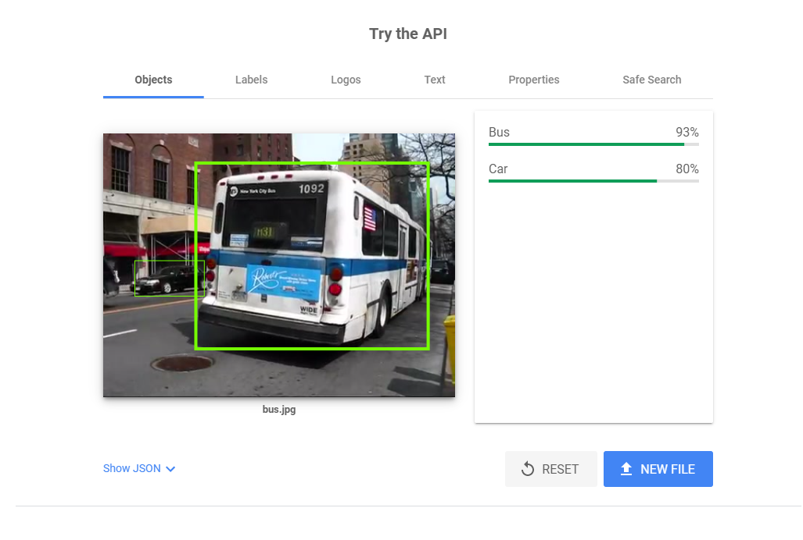

# hcaptcha-solver-go

An HCaptcha solver for GoLang.


##  Vision API
Vision API uses the Google Vision API to solve captchas.
It uses the object that we need to find, along with every image in the captcha's
task list to find the ones that match.

The solver uses it, mostly because it's the most reliable out there & it's quite easy to sign up for (basically free if you get the $300 free credit.)



# Usage
Below are some usage examples on how you would use the solver.

## No proxies, one worker:

```go
// In order to use Vision API, you need to set this environment variable.
// If not set, it will default to random guessing.
err := os.Setenv("GOOGLE_APPLICATION_CREDENTIALS", "C:\\Users\\JustTal\\VisionAPI\\Project.json")
if err != nil {
    panic(err)
}

// Create the solver with the default options.
s, err := hcaptcha.NewSolver("example.org")
if err != nil {
    panic(err)
}
defer s.Close()

// We provide a deadline that the solver must have the solution done by.
// If the deadline is not reached, an error is sent instead of the solution.
solution, err := s.Solve(time.Now().Add(3 * time.Minute))
if err != nil {
    panic(err)
}
// P0_eyJ0eXAiOiJKV1Q...
fmt.Println(solution)
```

## Proxied, one worker:

```go
s, err := hcaptcha.NewSolverWithProxies("example.org", proxies)
if err != nil {
    panic(err)
}
defer s.Close()
// We provide a deadline that the solver must have the solution done by.
// If the deadline is not reached, an error is sent instead of the solution.
solution, err := s.Solve(time.Now().Add(50 * time.Second))
if err != nil {
    panic(err)
}
// P0_eyJ0eXAiOiJKV1Q...
fmt.Println(solution)
```

# Resources

## [JimmyLaurent's HCaptcha Solver in JS](https://github.com/JimmyLaurent/hcaptcha-solver)
JimmyLaurent's helped a lot with the core structure of HCaptcha's API.
If you are interested in building your own solver, I would check out his repository,
although it is a bit outdated.

## [aw1875's HCaptcha Solver using Puppeteer](https://github.com/aw1875/puppeteer-hcaptcha)
aw1875 was a big help with the issues I was encountering with my own implementation.
His implementation is much more up to date then Jimmy Laurent's, so if you're
a JS developer, I would recommend using his work.
